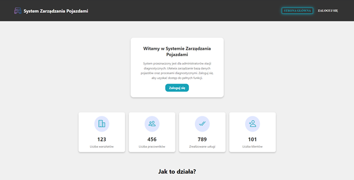
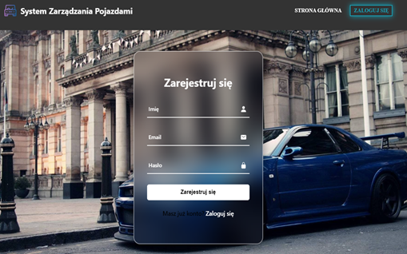
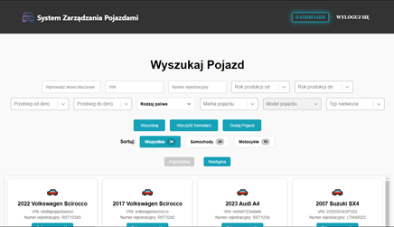
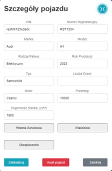
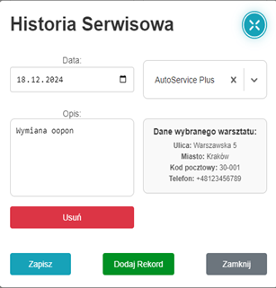
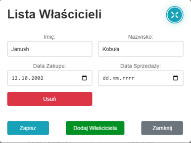
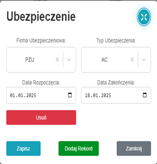
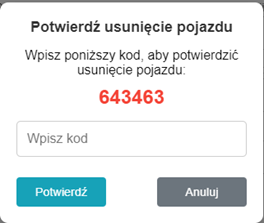

# Car System Diagnosis

Aplikacja webowa do zarządzania bazą pojazdów stworzona przy użyciu React.js, Node.js, Express.js, MongoDB, JavaScript, HTML, CSS, npm, nodemailer, axios, fs, path.



## Spis treści

1. [Opis założeń projektu](#opis-założeń-projektu)  
2. [Instalacja i uruchomienie aplikacji](#instalacja-i-uruchomienie-aplikacji)  
3. [Opis działań zespołu](#opis-działań-zespołu)  
4. [Wymagania funkcjonalne](#wymagania-funkcjonalne)  
5. [Wymagania niefunkcjonalne](#wymagania-niefunkcjonalne)  
6. [Struktura projektu](#struktura-projektu)  
7. [Harmonogram realizacji projektu](#harmonogram-realizacji-projektu)  
8. [Prezentacja warstwy użytkowej](#prezentacja-warstwy-użytkowej)  
9. [Wykorzystane funkcje języka JavaScript](#wykorzystane-funkcje-języka-javascript)  
10. [Podsumowanie](#podsumowanie)  
11. [Literatura](#literatura)  

---

## Opis założeń projektu

Aplikacja webowa służąca do kompleksowego zarządzania bazą pojazdów (samochodów oraz motocykli). Umożliwia dodawanie, edytowanie i usuwanie pojazdów, przeglądanie historii serwisowej, właścicieli oraz ubezpieczeń.

### Technologie:
- **React.js** – budowa interfejsu użytkownika
- **Node.js** + **Express.js** – backend i API
- **MongoDB** – nierelacyjna baza danych

---

## Instalacja i uruchomienie aplikacji

1. Pobierz repozytorium i wypakuj do wybranego folderu.
2. Upewnij się, że na komputerze zainstalowane są: Node.js oraz MongoDB.
3. Zainstaluj zależności, uruchamiając w głównym katalogu plik `install.bat`.
4. Uruchom aplikację za pomocą pliku `start.bat`.
5. Po uruchomieniu aplikacji automatycznie otworzy się przeglądarka ze stroną główną.

---

## Wymagania funkcjonalne

- **Strona główna** – prezentacja serwisu, przycisk do logowania  
- **Logowanie** – formularz z obsługą rejestracji i resetowania hasła  
- **Dashboard** – przeglądanie pojazdów, zaawansowane filtrowanie  
- **Dodawanie, edycja, usuwanie pojazdów** – pełen CRUD  
- **Zarządzanie danymi** – synchronizacja z bazą MongoDB

---

## Wymagania niefunkcjonalne

- **Wydajność** – szybkie ładowanie, odpowiedzi <2s
- **Zgodność** – obsługa Chrome, Firefox, Edge, Safari
- **Skalowalność** – łatwość rozbudowy
- **Użyteczność** – intuicyjny interfejs React

---

## Struktura projektu

```
Car-system-diagnosis1/
├── backend/        # logika serwera, modele, API
├── frontend/       # aplikacja React, komponenty, style, zasoby
│   └── src/
│       ├── components/
│       ├── pages/
│       ├── App.js
│       └── ...
├── projekt/
│   └── images/     # ilustracje aplikacji do dokumentacji
├── install.bat
├── start.bat
└── README.md
```

---

## Harmonogram realizacji projektu

Diagram Gantta dostępny w dokumentacji projektowej.

---

## Prezentacja warstwy użytkowej

### Główna strona
---


### Sekcja logowania
---


### Sekcja rejestracji
---


### Walidacja
---


### Komunikaty
---


### Resetowanie hasła
---


### Dashboard
---


### Szczegóły pojazdów
---


#### Historia serwisowa
---


#### Lista właścicieli
---


#### Ubezpieczenia
---


#### Usuwanie pojazdu
---


---

## Wykorzystane funkcje języka JavaScript

- Odczyt i zapis plików JSON
- Obsługa formularzy (handleLogin, handleRegister, handleSendEmail, handleAddRecord, handleChange, handleRemoveRecord, handleSubmit)
- Komunikacja z backendem przez fetch/axios
- Przechowywanie tokenów w sessionStorage/localStorage

---

## Podsumowanie

Projekt to kompleksowe rozwiązanie do zarządzania pojazdami z nowoczesnym, intuicyjnym interfejsem oraz solidnym backendem. Pozwala na sprawne przeglądanie, filtrowanie i modyfikację danych pojazdów, historii serwisowej, właścicieli i ubezpieczeń. Technologia React zapewnia przejrzystość i wygodę użytkowania, a MongoDB gwarantuje szybki dostęp do danych.

---

 
